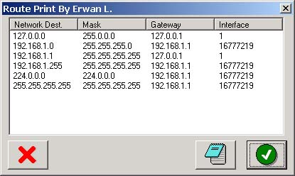



## Route Print

### Description

This piece of code displays the routing table, using the iphelper library : the network destination, the mask, the gateway, the interface.
 
### More Info
 

             |
---                |---
**Submitted On**   |2003-01-04 16:53:04
**By**             |[Erwan L\.](https://github.com/Planet-Source-Code/PSCIndex/blob/master/ByAuthor/erwan-l.md)
**Level**          |Advanced
**User Rating**    |5.0 (15 globes from 3 users)
**Compatibility**  |VB 6\.0
**Category**       |[Windows API Call/ Explanation](https://github.com/Planet-Source-Code/PSCIndex/blob/master/ByCategory/windows-api-call-explanation__1-39.md)
**World**          |[Visual Basic](https://github.com/Planet-Source-Code/PSCIndex/blob/master/ByWorld/visual-basic.md)
**Archive File**   |[Route\_Prin152409142003\.zip](https://github.com/Planet-Source-Code/erwan-l-route-print__1-42177/archive/master.zip)

